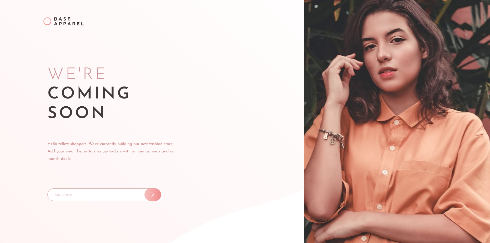

# Frontend Mentor - Base Apparel coming soon page solution

This is a solution to the [Base Apparel coming soon page challenge on Frontend Mentor](https://www.frontendmentor.io/challenges/base-apparel-coming-soon-page-5d46b47f8db8a7063f9331a0). Frontend Mentor challenges help you improve your coding skills by building realistic projects. 

## Table of contents

- [Overview](#overview)
  - [The challenge](#the-challenge)
  - [Screenshot](#screenshot)
  - [Links](#links)
- [My process](#my-process)
  - [Built with](#built-with)
  - [What I learned](#what-i-learned)
- [Author](#author)


## Overview

### The challenge

Users should be able to:

- View the optimal layout for the site depending on their device's screen size
- See hover states for all interactive elements on the page
- Receive an error message when the `form` is submitted if:
  - The `input` field is empty
  - The email address is not formatted correctly

### Screenshot



### Links

- Solution URL: [https://github.com/bugvlopper/FrontendMentro-base-apparel.git](https://github.com/bugvlopper/FrontendMentro-base-apparel.git)
- Live Site URL: [https://bugvlopper.github.io/FrontendMentro-base-apparel](https://bugvlopper.github.io/FrontendMentro-base-apparel)

## My process

### Built with

- JSX
- CSS custom properties
- Flexbox
- Mobile-first workflow
- [React](https://reactjs.org/) - JS library

**Note: These are just examples. Delete this note and replace the list above with your own choices**

### What I learned

I learn css property pointer-event:

```css
button img{
  pointer-events: none;
}
```

in ohter project i had to build big if else(in js) to counter bad element (especially child) being target from click instead of the lement i wanted to click.

## Author

- Frontend Mentor - [@bugvlopper](https://www.frontendmentor.io/profile/bugvlopper)


